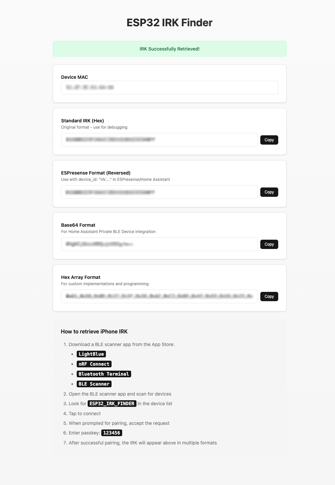

# ESP32 IRK Finder

A simple ESP32 firmware to retrieve iPhone's IRK (Identity Resolving Key) through Bluetooth pairing. The IRK can be used with Home Assistant, ESPresense, or other tracking systems to identify iPhones despite their rotating MAC addresses.

## 📚 Documentation

- **[Installation Guide](docs/installation.md)** - Detailed installation instructions for prebuilt firmware and building from source
- **[Usage Guide](docs/usage.md)** - How to configure WiFi and retrieve iPhone IRKs
- **[API Documentation](docs/api.md)** - REST API endpoints for integration
- **[Configuration Guide](docs/configuration.md)** - Customization options and settings
- **[Technical Documentation](docs/technical.md)** - Architecture and implementation details
- **[Development Guide](docs/development.md)** - Building, testing, and contributing

## Quick Start

### Using Prebuilt Firmware (Easiest)

1. Download firmware from `releases/` folder
2. Flash using [ESP Web Tools](https://web.esphome.io/) or esptool
3. Connect to ESP32's WiFi: `ESP32-IRK-FINDER` (password: `12345678`)
4. Configure your WiFi network
5. Use a BLE scanner app to connect and retrieve IRK

For detailed instructions, see the **[Installation Guide](docs/installation.md)**

## Features

- ✅ BLE secure pairing with iPhone
- ✅ Multiple IRK output formats (Hex, ESPresense, Base64, Array)
- ✅ Web-based WiFi configuration portal
- ✅ Support for ESP32, ESP32-S3, and ESP32-C3
- ✅ Automatic AP mode with captive portal
- ✅ RESTful API for integration
- ✅ Real-time status updates
- ✅ Persistent credential storage

## Supported Devices

- **ESP32** - Original ESP32 chip
- **ESP32-S3** - Latest generation with USB support
- **ESP32-C3** - RISC-V based, cost-effective option

## How It Works

1. **ESP32 creates a BLE device** that iPhones can discover via BLE scanner apps
2. **iPhone pairs with ESP32** using secure bonding with passkey authentication
3. **IRK is exchanged** during the pairing process
4. **Web interface displays IRK** in multiple formats for easy integration
5. **Use IRK in your system** (Home Assistant, ESPresense, etc.) to track iPhone

## Getting the IRK

### Quick Steps:
1. Flash firmware to ESP32
2. Configure WiFi (optional)
3. Download a BLE scanner app on iPhone
4. Connect to "ESP32_IRK_FINDER"
5. Enter passkey: **123456**
6. View IRK on web interface

**Note:** The ESP32 won't appear in iPhone Settings > Bluetooth. You must use a BLE scanner app.

## Security Note

The IRK is sensitive information that can be used to track your iPhone. Keep it secure and only share with trusted systems.

## License

MIT License - Feel free to modify and use as needed.